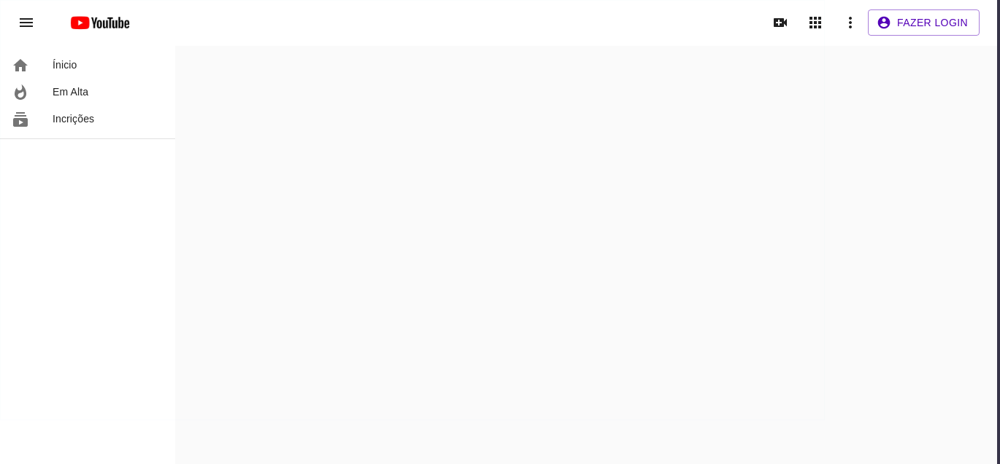
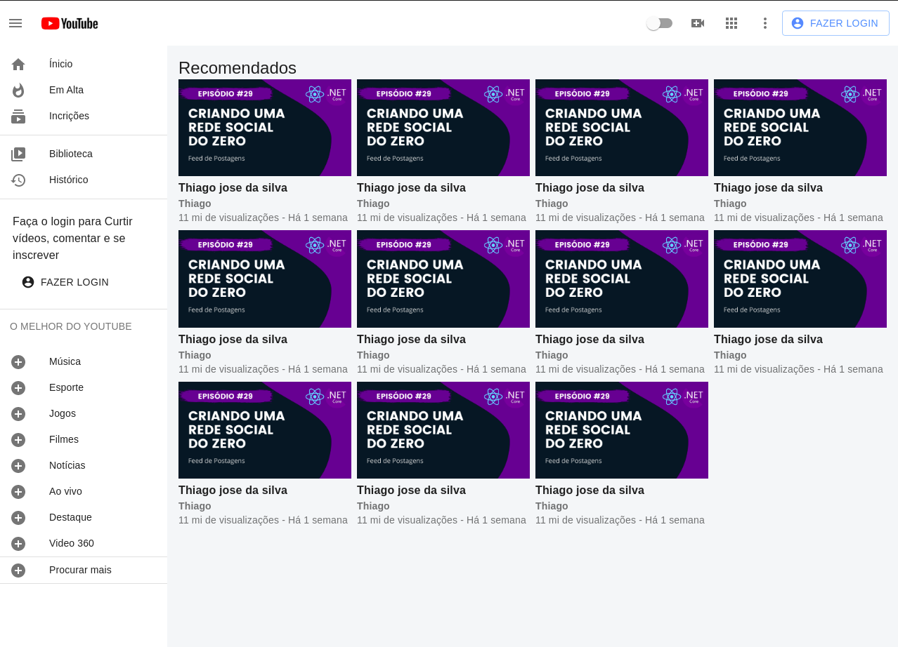
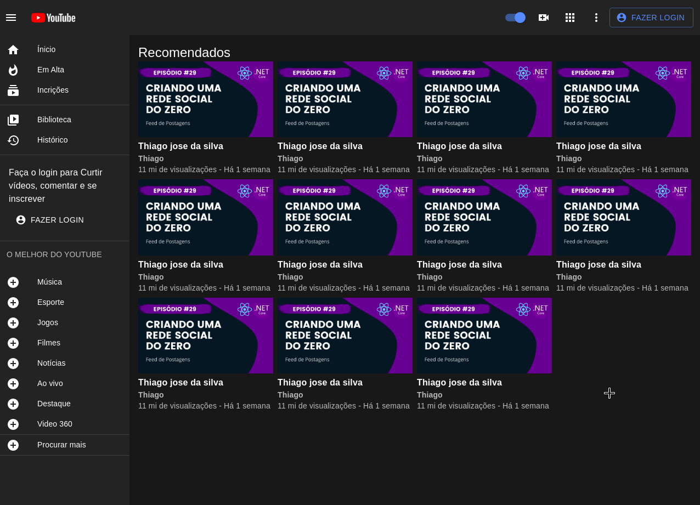
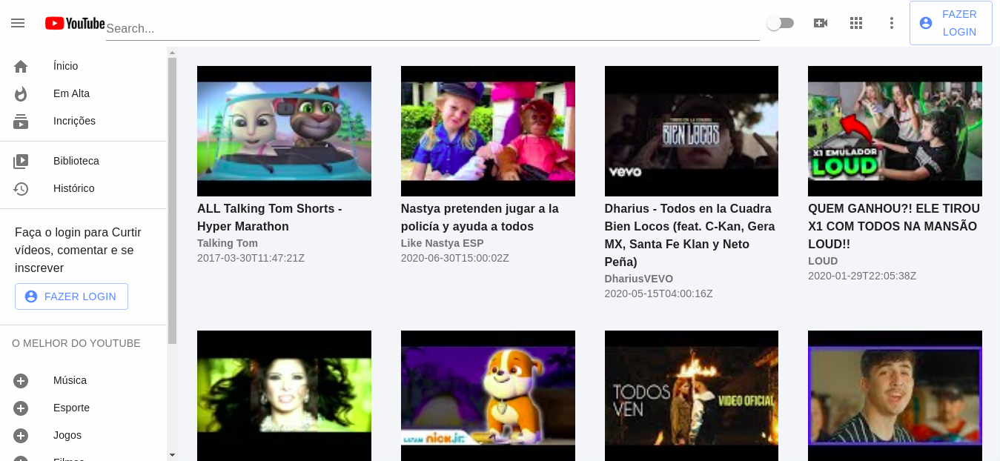

### Projeto clone da plataforma youtube, onde vamos fazer o desenvolvimento usando a biblioteca <b>Mateiral-UI</b> usando a tecnologia <b>REACJS</b>

- Dentro do <b>README</b> da pasta do projeto está tudo que foi ou está sendo usando.
   * https://github.com/thiagoadssilva/youtubeCloneMateiralUI/blob/main/frontend/README.md

## Observação
- Todo conteúdo desenvolvido foi tirado do canal do youtube: https://www.youtube.com/watch?v=u9FnmBdBl5k&ab_channel=LucasNhimi

## Projeto publicado: 
   * youtubematerialui.tfcoder.com

## <b>Inicio</b> do desenvolvimento do clone, parte do header com a lateral

## <b>Finalização</b> do desenvolvimento do clone, com o layout light

## <b>Finalização</b> do desenvolvimento do clone, com o layout dark

## Usando a api de pesquisa do youtube

